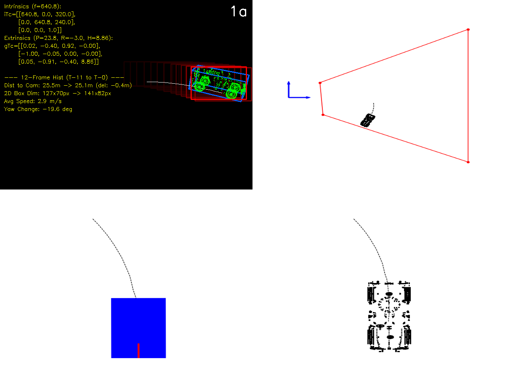
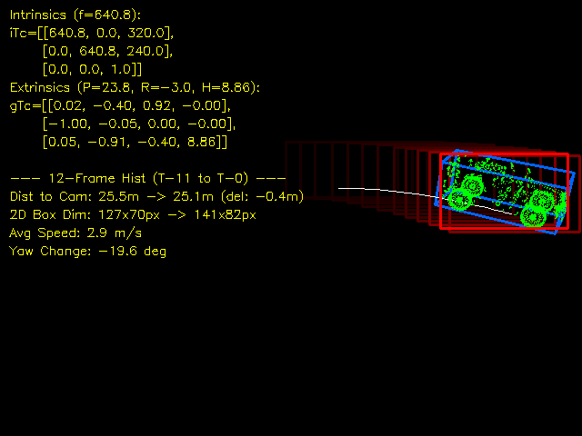
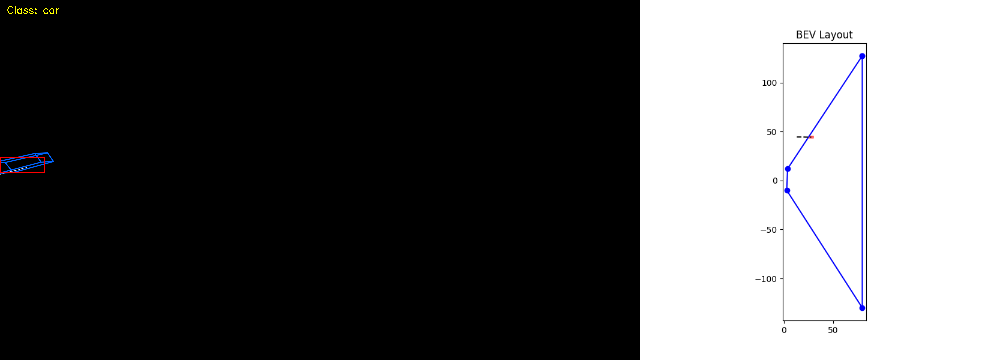
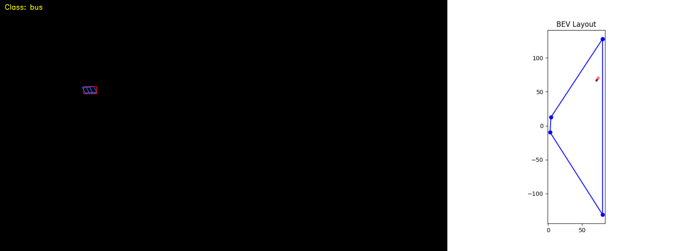
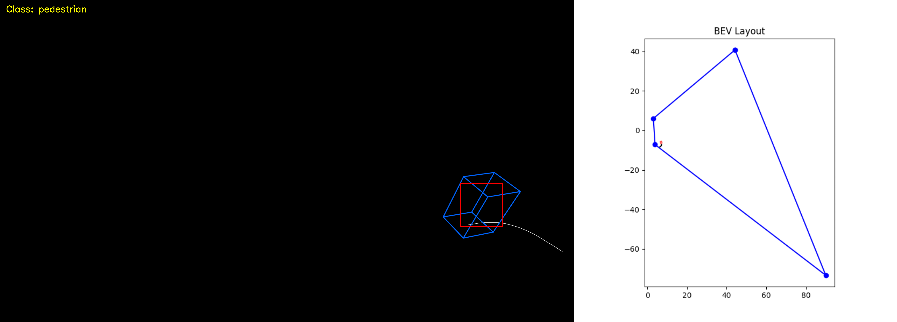
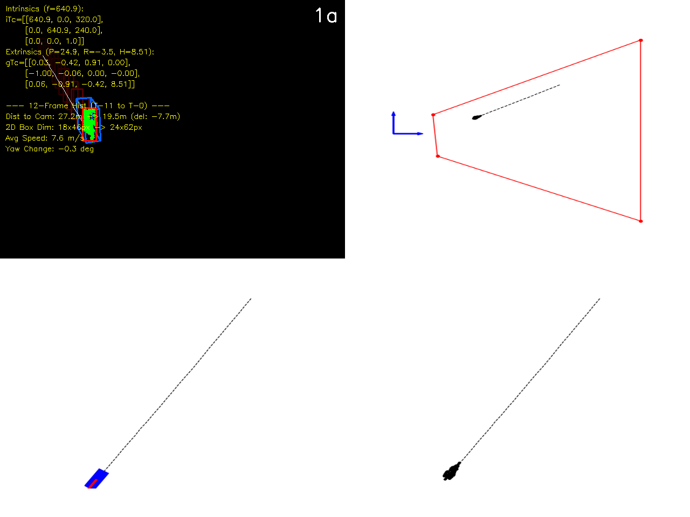
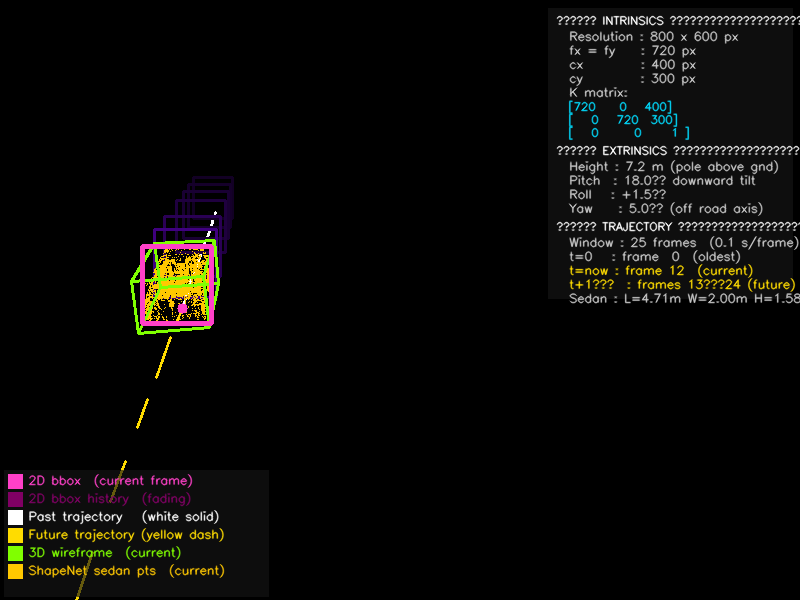
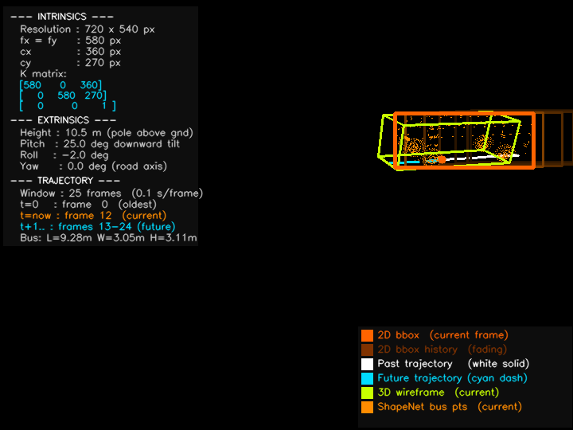

# Zero-Shot Monocular 3D Localization from Infrastructure Cameras

<div align="center">

[](https://www.python.org/)
[](https://pytorch.org/)
[](https://wandb.ai)
[](LICENSE)
[](https://waymo.com/open/data/motion/)

**Thesis Project — Technische Hochschule Ingolstadt (THI)**

*Monocular 3D object localization from a fixed infrastructure camera — no depth sensor, no stereo, no LiDAR.*

</div>

---

## Overview

This repository contains **Model D**, the final and most capable architecture in a 4-model ablation study (A → B → C → D) for **zero-shot monocular 3D localization** from infrastructure cameras.

Given only a sequence of **2D bounding boxes** from a fixed overhead camera, the model predicts each agent's **3D position, size, and orientation** in Bird's-Eye View (BEV) — entirely from monocular geometric cues and camera parameters.

<div align="center">


*Figure 1 — Camera image with projected 3D box (left) and top-down BEV trajectory prediction (right).*
</div>

---

## Key Results — Model D on 64 k Waymo Scenes

| Class | BEV MAE ↓ (m) | BEV IoU ↑ |
|-------|--------------|-----------|
| Car | 0.949 | 0.472 |
| Bus | 1.256 | 0.502 |
| Pedestrian | **0.682** | 0.242 |
| Cyclist | 0.823 | 0.242 |
| **Overall** | **0.894** | **0.380** |

**Orientation error:** 6.37° &nbsp;|&nbsp; **Size MAE:** 0.162 m

**By range:**

| Range | BEV MAE ↓ (m) | BEV IoU ↑ |
|-------|--------------|-----------|
| 0 – 20 m | 0.900 | 0.368 |
| 20 – 60 m | **0.647** | **0.482** |
| 60 – 100 m | 1.040 | 0.320 |

> All metrics from W&B run [`5uj44tug`](https://wandb.ai/ashfaqafr24/twoDthreeDnet_Ablation/runs/5uj44tug) — project `twoDthreeDnet_Ablation`.

---

## Architecture: Model D (TwoDThreeDNetV2)

Model D adds **multi-stream fusion**, **Rotary Positional Encoding (RoPE)**, and **deep supervision** over the paper baseline.

```
Input sequence  (T × 18D)
  [0:4]   d  — 2D bbox (u, v, j, k)  normalised centre + dims
  [4:14]  d̃  — 10D ground-plane projections  (5 corners × 2D)
  [14:18] δ  — camera params  (focal, pitch, roll, height)

           ┌──────────────────────────────────────────────────┐
           │  Appearance stream   Linear(18→D) + RoPE encoder │
           │  Geometry stream     Linear(18→D) + RoPE encoder │
           │  Camera context      Linear(4→D)  token          │
           │            ↓  gated cross-attention fusion        │
           │  Fused memory   (T × D)                          │
           │            ↓                                      │
           │  Iterative Decoder  × 4 layers                   │
           │   • anchor-initialised class-conditioned queries  │
           │   • deep-supervision aux loss  (wt = 0.4)        │
           └──────────────────────────────────────────────────┘
           ↓
     Predictions  (S × 8)  [Δx, Δy, z, l, w, h, cos θ, sin θ]
```

### Ablation progression

| Model | Key addition | BEV MAE ↓ |
|-------|-------------|-----------|
| A — Paper Baseline | Standard Transformer, 16D | ~2.1 m |
| B — Occlusion-Aware | CAPE ray PE + anchor queries | ~1.6 m |
| C — Social-Aware | Multi-stream + RoPE, 18D | ~1.1 m |
| **D — SOTA** | **Deep supervision + 64 k dataset** | **0.89 m** |

---

## Dataset: Waymo Open Motion Dataset (WOMD)

The synthetic training corpus is built by fusing **WOMD** trajectories with **ShapeNet** meshes:

### Step 1 — Trajectory extraction
12-frame sliding windows are extracted from Waymo scenario `.tfrecord` files.  
Only tracks with ≥ 8 visible frames are retained (car / bus / pedestrian / cyclist).

### Step 2 — ShapeNet geometry download & alignment
Each track is matched to a ShapeNet mesh (by class + approximate dimensions).  
The mesh is rigidly aligned to the Waymo 3D bounding box.

### Step 3 — Synthetic camera projection
A simulated fixed-overhead infrastructure camera projects each agent:

| Parameter | Range |
|-----------|-------|
| Focal length | 500 – 1100 px |
| Camera pitch | 10° – 30° |
| Camera height | 6 – 12 m |
| Image resolution | 1920 × 1080 |

### Dataset statistics (`master_train_64k_v2`)

| Subset | Count |
|--------|-------|
| Urban scenes | 32 000 |
| Total samples | ~64 000 |
| Cars | ~45 k tracks |
| Buses | ~10 k tracks |
| Pedestrians | ~16 k tracks |
| Cyclists | ~10 k tracks |

```
dataset_cache/master_train_64k_v2/
├── shard_000.npy          # (N, T, 18) float32 — inputs
├── shard_000_tgt.npy      # (N, T, 8)  float32 — targets
└── ...                    # 64 shards total
```

<div align="center">


*Sample: sedan trajectory over 12 frames with aligned ShapeNet mesh.*
</div>

---

## Qualitative Results

### Per-class verification composites

<table>
  <tr>
    <td align="center">
      <br/><b>Car</b>
    </td>
    <td align="center">
      <br/><b>Bus</b>
    </td>
    <td align="center">
      <br/><b>Pedestrian</b>
    </td>
    <td align="center">
      <br/><b>Cyclist</b>
    </td>
  </tr>
</table>

*Top row: camera image with projected 3D box. Bottom row: BEV top-down view — predicted (red) vs ground-truth (green) trajectory.*

### Sample inference outputs

<table>
  <tr>
    <td align="center">
      <br/><b>Sedan — single-agent inference</b>
    </td>
    <td align="center">
      <br/><b>Bus — single-agent inference</b>
    </td>
  </tr>
</table>

---

## Weights & Biases Training Dashboard

Training was fully logged with metric tracking, gradient histograms, and BEV scatter visualizations.

| Run ID | Model | Dataset | Best BEV MAE | Best BEV IoU |
|--------|-------|---------|-------------|-------------|
| [`5uj44tug`](https://wandb.ai/ashfaqafr24/twoDthreeDnet_Ablation/runs/5uj44tug) | Model D | master_64k | **0.887 m** | **0.394** |

Logged metrics include:
- `train/loss`, `train/loss_pos`, `train/loss_ori`, `train/grad_norm`
- `val/bev_mae`, `val/bev_iou` — per epoch
- `val/bev_mae_{car,bus,pedestrian,cyclist}` — per class
- `val/bev_mae_{0_20m,20_60m,60_100m}` — per range bin
- BEV scatter plots of predicted vs ground-truth positions (logged as W&B images)

---

## Project Structure

```
zero_shot_monocular_3d/
├── README.md
├── requirements.txt
├── LICENSE
├── configs/
│   └── model_d.yaml               ← training hyperparameters
├── src/
│   ├── infraformer_sota.py        ← InfraFormerSOTA (Model D SOTA variant)
│   ├── infraformer_v2.py          ← TwoDThreeDNetV2 base (RoPE + deep supervision)
│   ├── model_D.py                 ← simplified depth-head wrapper
│   ├── loss.py                    ← trajectory loss with deep supervision
│   ├── evaluate.py                ← evaluation script
│   ├── inference.py               ← single-agent Figure 1 composite generator
│   └── utils.py                   ← geometry, projection, visualization helpers
├── assets/
│   ├── figure1_composite.png      ← main paper figure
│   ├── figure1a_scene.png
│   ├── sample_sedan.png
│   ├── sample_bus.png
│   └── verification/
│       ├── verify_car.png
│       ├── verify_bus.png
│       ├── verify_pedestrian.png
│       └── verify_cyclist.png
└── results/
    └── model_d_results.json       ← full evaluation metrics
```

---

## Quickstart

### 1. Clone and install

```bash
git clone https://github.com/Asfak3566/Zero-Shot-Monocular-3D-perception-system.git
cd Zero-Shot-Monocular-3D-perception-system
pip install -r requirements.txt
```

### 2. Prepare the dataset

```bash
# Extract trajectories from WOMD .tfrecord files
python tools/extract_womd.py --tfrecord_dir /path/to/waymo/v1.2 --out_dir dataset_cache/

# Download and align ShapeNet meshes
python tools/download_shapenet.py
python tools/align_geometry.py --dataset_dir dataset_cache/

# Verify dataset shards
python tools/verify_dataset.py --shard_dir dataset_cache/master_train_64k_v2/
```

### 3. Train Model D

```bash
# Set your W&B key first (never commit this)
export WANDB_API_KEY=<your_wandb_api_key>

python -m src.train \
    --config configs/model_d.yaml \
    --dataset_dir /path/to/dataset_cache/master_train_64k_v2 \
    --wandb_project twoDthreeDnet_Ablation
```

### 4. Evaluate

```bash
python -m src.evaluate \
    --checkpoint checkpoints/checkpoint_best.pth \
    --dataset_dir /path/to/dataset_cache/master_train_64k_v2
```

### 5. Single-agent inference (Figure 1 composite)

```bash
python -m src.inference \
    --image path/to/image.jpg \
    --weights checkpoints/checkpoint_best.pth \
    --output_dir outputs/
```

---

## Loss Function

```
L_total = λ_pos · MSE(Δx, Δy)
        + λ_ori · (1 − cos_similarity(θ_pred, θ_gt))
        + λ_size · SmoothL1(l, w, h)
        + λ_aux · Σ_k L(intermediate_k)    ← deep supervision  (aux_wt = 0.4)
```

Per-class loss weights: **pedestrian ×5**, **bus ×2**, cyclist ×1.5.

---

## Citation

```bibtex
@thesis{ashfaq2026zeroshotthi,
  title  = {Zero-Shot Monocular 3D Object Localization from Infrastructure Cameras},
  author = {Ashfaq},
  school = {Technische Hochschule Ingolstadt (THI)},
  year   = {2026},
  note   = {https://github.com/Asfak3566/Zero-Shot-Monocular-3D-perception-system}
}
```

---

## License

MIT — see [LICENSE](LICENSE).
